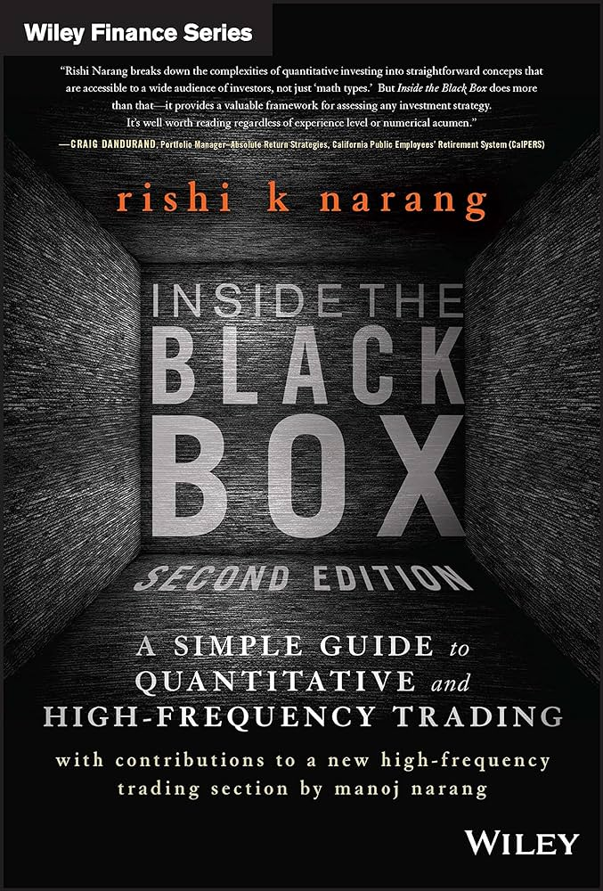

---
# Leave the homepage title empty to use the site title
title: "Supervised learning"
date: 2022-10-24
type: landing

design:
  # Default section spacing
  spacing: "6rem"

sections:
- block: markdown
  content:
    text: |-
        

        # Financial lectures

        

        
        

        ## Inside the Black Box: A Simple Guide to Quantitative and High-Frequency Trading, 2nd Edition, Rishi K. Narang

        * p.7: Quants typically make markets more efficient for other participants by providing liquidity when other traders' needs cause a temporary imbalance in the supply and demande for a security. (...) Riskless profit, or arbitrage, is not the only-or even primary- way in which quants improve efficiency. The main inefficiencies quants eliminate (and, thereby, profit from) are not absolute and unassailable,  but rather are probabilistic and require risk taking. (example: statistical arbitrage)
        * p.10: Discretionary investors often find it very difficult to realize losses, whereas they are quick to realize gains. This is a well-documented behavioral bias known as the disposition effect.
        * p.13: One Washington Post article: "A quant fund is a hedge fund that relies on complex and sophisticated mathematical algorithms to search for anomalies and non-obvious patterns in the markets".
        * p.14: Statistical arbitrage is based on the theory that similar instruments should behave similarly. If their relative prices diverge over the short run, they are likely to converge again. So long as the stocks are still similar, the divergence is more likely due to a short-term imbalance between the amount of buying and selling of these instruments, rather than any meaningful fundamental change that would warrant a divergence in prices. It also happens to be a strategy that discretionary traders use, though it is usually called *pairs trading*.
        * p.16: Many quants reserve the right to reduce the overall size of the portfolio (and therefore leverage) if, in their discretion, the markets appear too risky. For example, after the attacks of September 11, 2001, many quants reduced their leverage in the wake of a massive event that would have unknowable repercussions on capital markets. Once things seemed to be operating more normally in the markets, the quants increased their leverage back to normal levels.
        * p.16: If both the qeustions of *what positions* to own and *how much* of each to own are usually answered systematically, that's a quant. If either one is answered by a human as standard operating procedure, that's not a quant.
        * p.17: The trading system has three modules-an alpha model, a risk model, and a transaction cost model-which fed into a portfolio construction model, which in turn interacts with the exectuion model.
        * p.25: *Theoretical scientists* try to make sense of the world around them by hypothesizing why it is the way it is. (...) *Empirical scientists* believe that enough observations of the world can allow them to predict future patterns of behavior, even if there is no hypothesis to rationalize the behavior in an intuitive way.
        * p.26: Most quants you will come across are theory driven. (...) What theory-driven quants do can be relatively easily fit into one of six classes of phenomena: trend, reversion, technical sentiment, value/yield, growth, and quality.
        * p.31: when discretionary traders implement mean reversion strategies, they are typically known as *contrarians*.
        * p.32: Stat arb ushered in an important change in worldview, one that focused on whether Company A was over- or undervalued *relative* to Company B rather than Company A was simply cheap or expensive *in itself*.
        * p.32: Trends tend to occur over longer time horizons, whereas reversions tend to happen over shorter-term time horizons.
        * p.34: If puts have higher volumes relative to calls than they normally do, it might be an indicator that investors are worried about a downturn. (...) A second example of options-based sentiment in equities utilizes the implied volatilities of puts versus calls.
        * p.35: Rather, combining betas with historical data about tht ebook-to-price ratio and the market capitalization of the stocks was a better determinant of future returns.
        * p.37: When done on a relative basis, that is, buying the undervalued security and selling the overvalued one against it, this strategy is also known as a *carry trade*. The spread between the yield received and the yield paid is the *carry*. If nothing else happens, a carry trade offers an investor a baseline rate of return, which acts as the margin of safety Graham and Dodd were talking about.
        * p.38: Quant long/short (QLS) traders tend to rank stocks according to their attractiveness based on various factors, such as value, and then buy the higher-ranked stocks while seling short the lower-ranked ones.
        * p.39: Roll yield is the spread between the price of a futures contract with some expiry date in the future, versus that of the spot. Because there is a convergence of futures contracts up to the spot price, futures in this situation are considered to have positive roll yield.
        * p.39: It is better to buy assets that are experiencing rapid economic growth and/or to sell assets that are experiencing slow or negative growth. (growth sentiment)
        * p.41: there are measures found, for example, in companie's financial statements, including changes in discretionary accruals (the idea being, the greater the increase in discretionary accruals, the more likely there are problems with the management's stewardship of the company).
        * p.44: the data-mining strategy requires nearly constant adjustment to keep up with the changes going on in markets, an activity that has many risks in itself.

        ## Various lectures

        ** De la physique statistique aux sciences sociales, Jean-Philippe Bouchaud (2020-2021)

        [Youtube](https://www.youtube.com/watch?v=AFW90xdIPy8):

        Théorie de la spéculation par Louis Jean-Baptiste Alphonse Bachelier (1870-1946), thèse encadrée par Henri Poincaré (1900). Invention du mouvement brownien (5 ans avant Einstein) et découverte de ses propriétés, formule de valorisation des options (72 ans avant Black-Scholes). 

        In large organisations a range of instruments and data will be stored. Here are some of the instruments that might be of interest to a firm:
        - Equities
        - Equity Options
        - Indices
        - Foreign Exchange
        - Interest Rates
        - Futures
        - Commodities
        - Bonds - Government and Corporate
        - Derivatives - Caps, Floors, Swaps
        
        The most basic method to store financial data is through flat-file storage, such as CSV files. However, these files do not support querying and perform poorly when managing large datasets. As an alternative, document stores or NoSQL databases are often used due to their flexibility in not requiring predefined table schemas. Examples of popular document stores include MongoDB, Cassandra, and CouchDB. Despite their advantages, NoSQL databases are not ideally suited for handling time-series data, such as high-resolution pricing information.

        Backtesting provides a host of advantages for algorithmic trading. However, it is not always possible to straightforwardly backtest a strategy. In general, as the frequency of the strategy increases, it becomes harder to correctly model the microstructure effects of the market and exchanges. This leads to less reliable backtests and thus a trickier evaluation of a chosen strategy. This is a particular problem where the execution system is the key to the strategy performance, as with ultra-high frequency algorithms.

        ## Biases affecting strategy backtests
        - optimisation bias
        - look-ahead bias
        - survivorship bias
        - psychological tolerance bias

        ## Market efficiency

        **Imperfect Market Efficiency**: In a perfectly efficient market, all available information about asset values is already reflected in their prices. If this were the case, there would be no incentive for anyone to gather further information, as it would not lead to any profitable trading opportunities. Everyone would assume that asset prices are always correct, which would eliminate the motivation to seek out and act on new information.

        Because markets are not perfectly efficient, there is an opportunity for traders, especially institutional ones like hedge funds, to gather information that is not yet reflected in market prices. By identifying undervalued or overvalued assets based on this additional information, these traders can buy or sell these assets for a profit before the market corrects itself.
        
        The market’s inefficiency must be at a level that still provides enough potential for profit to justify the costs and efforts involved in information gathering and trading. If the market were too efficient, the small margins would not cover these costs, discouraging the activity. Conversely, if the market were highly inefficient, opportunities for profit would be so abundant that rapid trading by well-informed participants would quickly eliminate these inefficiencies.
        
        Hedge funds invest significant resources in sophisticated research to detect price inefficiencies and act on them. Their trading helps to move prices closer to their “true” values, thereby contributing to market efficiency. However, they must continually adapt and find new inefficiencies as their successful trades will naturally help to correct the inefficiencies they exploit.

        ## Put-Call Parity

        **Put-call parity** is a fundamental principle in options pricing, which establishes a defined price relationship between a call option, a put option, and their underlying stock. According to put-call parity, the combination of a long call option and a short put option should have the same return as if one owned the stock and owed a fixed amount of cash, assuming the options have the same strike price and expiration date.

        ### Formula

        The put-call parity formula is expressed as:

        $$
        C - P = S - E e^{-r(T-t)}
        $$

        - **C** = Current price of the European call option
        - **P** = Current price of the European put option
        - **S** = Current stock price
        - **E** = Strike price of the options
        - **e** = Base of the natural logarithm
        - **r** = Risk-free annual interest rate
        - **T** = Time to maturity of the options
        - **t** = Current time

        ### Financial Interpretation

        - **Arbitrage Opportunity**: If the relationship described by put-call parity does not hold, arbitrage opportunities may exist, allowing risk-free profits.
        - **Hedging Strategy**: Put-call parity provides a basis for constructing equivalent positions that can help in hedging.

        More information on these [lectures notes](https://personalpages.manchester.ac.uk/staff/sergei.fedotov/20912lecture7.pdf)

        ## Black-Scholes Formula

        Price of a call option from a stock S: $V(S,t)$

        We build a portfolio $\Pi = V(S,t) -\Delta S$

        Therefore, $d\Pi = dV - \Delta dS$

        The stock price can be modelled by a geometric brownian motion: $$dS = \mu Sdt + \sigma S dW$$ (drift term + volatility term)

        From Ito's lemma: $$dV = \frac{dV}{dt}dt + \frac{dV}{dS}dS + \frac{1}{2} \frac{d^2V}{dS^2}dS^2$$

        and stochastic calculus rules give $dS^2 = \sigma^2 S^2 dt$

        Therefore, $$dV = \frac{dV}{dt}dt + \frac{dV}{dS}dS + \frac{1}{2} \sigma^2 S^2 \frac{d^2V}{dS^2}dt$$

        so $$d\Pi = (\frac{dV}{dt} + \frac{1}{2} \sigma^2 S^2 \frac{d^2V}{dS^2}dS^2)dt + (\frac{dV}{dS} - \Delta)dS$$

        Setting $\Delta = \frac{dV}{dS}$ removes any stochastic term, we obtain a risk-free portfolio, thus a risk-free rate: $$d\Pi = r\Pi dt = (rV - rS \frac{dV}{dS})dt$$

        Equating both $dt$ term leads to the Black-Scholes PDE: $$\frac{dV}{dt} + \frac{1}{2} \sigma^2 S^2 \frac{d^2V}{dS^2}dS^2 + rS \frac{dV}{dS} - rV = 0$$

        ### What is a Market Maker?

        A market maker is a key participant in financial markets, constantly buying securities from sellers and selling to buyers. This activity provides essential liquidity, ensuring that securities can be traded quickly and at fair prices, thus bolstering investor confidence.

        **Role and Importance**

        Market makers are crucial during volatile market conditions as they provide liquidity and depth, allowing for the quick buying and selling of securities in large volumes.
        They help stabilize market prices and bridge the gap between supply and demand, contributing to a more orderly trading environment.
          •	Efficient Capital Allocation: Particularly during events like IPOs, market makers facilitate an orderly trading process, ensuring efficient capital flows and supporting broader economic growth.

        **Benefits to Investors**

          •	Price Improvement: For retail investors, market makers often offer better pricing than what is available on public exchanges, leading to significant savings and more accessible financial opportunities.

        **Operational Excellence**

          •	Innovation and Competition: Market makers compete fiercely with other participants, necessitating continuous innovation, advanced predictive analytics, and robust systems to enhance trading outcomes.
          •	Risk Management: They must adeptly manage market risks and anticipate shifts in market dynamics to maintain profitability, primarily earning through the ‘bid-ask spread’—the difference between buying prices and selling prices.

        **Regulation and Industry Impact**

          •	Regulatory Compliance: Market making is a highly regulated sector, with entities commonly registered with major financial regulatory bodies worldwide.
          •	Collaboration with Regulators: Market makers work closely with regulators to align on priorities and contribute positively to market structures, reinforcing investor confidence and ensuring market integrity.

        ## From my readings, here are some areas/notions I need to explore:

        * index fund
        * P/E ratio: the price-to-earnings ratio is the proportion of a company's share price to its earnings per share.
        * book-to-price ratio: calculated by dividing the market price per share by the book value per share. Interpretation: P/B < 1: the stock is potentially undervalued / the company is performing poorly / the market doesn't believe the company's assets are worth the value on its balance sheet. A stock with a higher book-to-price ratio might outperform stocks with lower book-to-price ratios over the coming quarters.

        Company Financial Transactions: Only transactions that the company itself engages in, such as issuing new shares, repurchasing shares, or acquiring assets, affect the book value.
        

---
